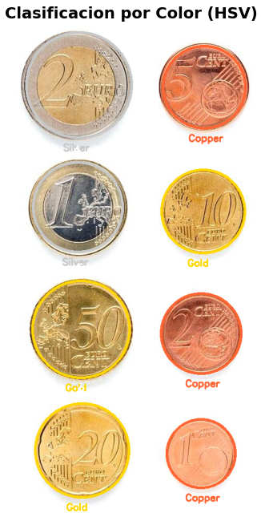
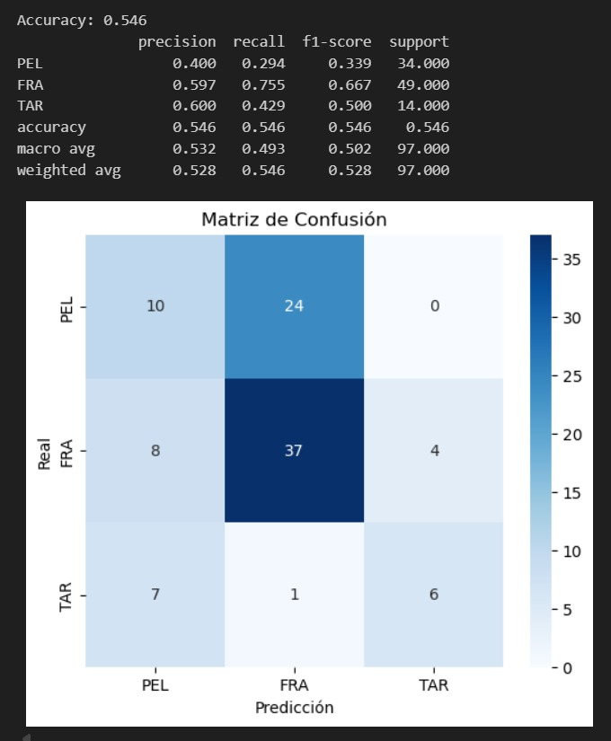
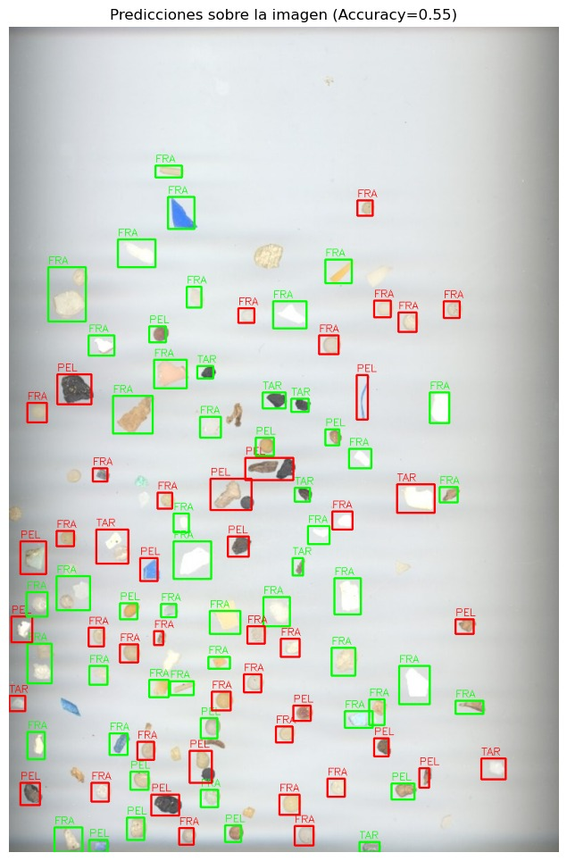
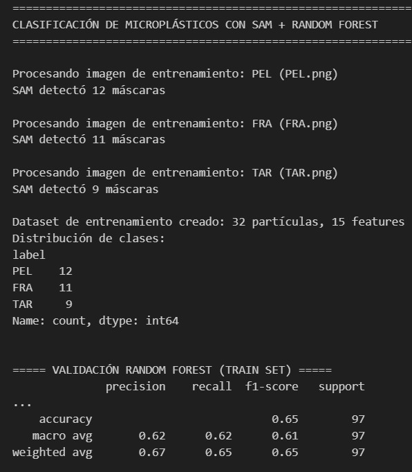
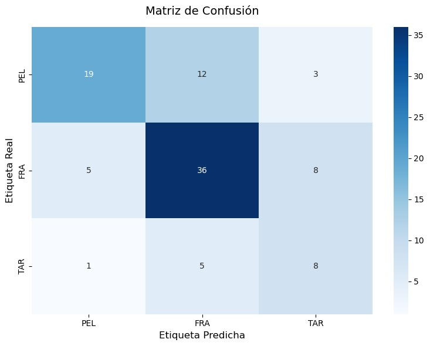

# Práctica 3: Procesamiento avanzado de imágenes y Detección de monedas

## Descripción

En esta práctica hemos desarrollado un pipeline completo para la detección, clasificación y estimación de valor de monedas en imágenes usando OpenCV y Matplotlib. El cuaderno principal es `VC_P3_entrega.ipynb`.

La tarea principal consiste en detectar las monedas presentes en una imagen, clasificar su material/ color (cobre / oro / plata), estimar su tamaño real usando una moneda de referencia y, finalmente, asignarles una denominación monetaria para calcular el total presente.

## Autores

- **Wail Ben El Hassane Boudhar**
- **Gorka Eymard Santana Cabrera**

## Requisitos

Para ejecutar el contenido de `VC_P3_entrega.ipynb` se recomiendan dos perfiles de instalación:

- Requisitos mínimos (Tarea 1 — detección y clasificación de monedas):
  - Python 3.10+
  - opencv-python
  - numpy
  - matplotlib

- Requisitos completos (incluye Tarea 2 — Random Forest, validación y visualización):
  - pandas
  - seaborn
  - scikit-learn
  - joblib
  - (más los del bloque mínimo)

- Requisitos para la variante con SAM (Segment Anything Model):
  - torch (instalar la versión compatible con su CUDA; CPU funciona pero es mucho más lento)
  - instalar SAM (recomendado desde el repositorio oficial)
  - descargar el checkpoint `sam_vit_b_01ec64.pth` y colocarlo en la ruta indicada por la variable `SAM_CHECKPOINT` en el notebook

Instalación (ejemplo en PowerShell):

- Mínimo:
```powershell
pip install "opencv-python>=4.5" "numpy>=1.23" "matplotlib>=3.5"
```

- Completo:
```powershell
pip install "opencv-python>=4.5" "numpy>=1.23" "matplotlib>=3.5" pandas seaborn scikit-learn joblib
```

- Con SAM (ejemplo, ajuste torch según su GPU/CUDA):
```powershell
# instalar PyTorch según su sistema (ejemplo CPU)
pip install torch torchvision --index-url https://download.pytorch.org/whl/cpu
# instalar SAM (desde GitHub)
pip install git+https://github.com/facebookresearch/segment-anything.git
```

Notas prácticas:
- El notebook asume que los ficheros de imagen y CSV están en el mismo directorio del proyecto o que las rutas en las variables (`IMAGE_PATH`, `TRAIN_IMGS`, `TEST_IMG`, `TEST_CSV`, `SAM_CHECKPOINT`) se ajustan.
- Para usar SAM coloque el checkpoint (`sam_vit_b_01ec64.pth`) en la ruta indicada o modifique `SAM_CHECKPOINT` en el notebook.
- Si se usa GPU, instale la versión de torch compatible con su versión de CUDA siguiendo las instrucciones oficiales de PyTorch.
- Reproducibilidad: si se desea, fijar versiones concretas (por ejemplo opencv-python==4.7.0, numpy==1.25.0, matplotlib==3.8.0, scikit-learn==1.2.2).

## Desarrollo

### Tarea 1: Detección y clasificación de monedas

- El objetivo de esta tarea es calcular el valor de las monedas que hay en una image, para ello se hará uso de hough para detectar las monedas y procesamiento de color y calculo de tamaño para clasificarlas en el valor que le corresponda.
- Esta tarea se divide principalmente en 3 chunks
#### Chunk 1: Detección de monedas (Hough)
- Descripción: se carga la imagen, la suavizamos y buscmos los círculos usando hough(basándonos en los tamaños de la imagen para definir de que dimensiones esperamos las monedas). Una vez hemos encontrado las monedas las marcamos.

#### chunk 2: Clasificación por color (HSV)
- Descripción: Clasificamos las monedas en tres grupos de color usando máscaras HSV. Para clasificarlas 
- Implementación: Primero definimos unos rangos de color para cada grupo(copper, gold, silver). A continuación recorremos las monedas detectadas y en combinación con las máscaras de color calculamos la cantidad de pixeles de cada color que hay, y clasificamos en consecuencia:
    - Para que sea silver el ratio de pixeles de gold debe ser mayor que los de cobre y el ratio de pixeles de plata respecto a pixeles de oro debe ser mayor o igual al 20%
    - Para que sea copper el ratio de pixeles de cobre respecto al ratio de pixeles de oro debe ser mayor al 70%
    - Entra en la clasificación gold si no pasa las anteriores.



#### chunk 3: Clasificación por tamaño y estimación de valor

- Descripción: en este chunk final se parte de la idea de que siempre tenemos la moneda más grande del grupo de monedas clasificadas en el chunk anterior como gold, copper o silver en ese orden(la moneda de referencia).
- Implementación: tras definir cual será nuestra moneda de referencia, a partir de ella calculamos el ratio de mm/px y los ratios esperados de tamaño con respecto a la moneda de referencia y lo combinamos con la diferencia real de tamaño para usarlos en una heurística de puntuación. A continuación recorremos las monedas detectadas y teniendo en cuenta el color en el que se clasificó comprobamos su tamaño con respecto a la moneda de referencia y la clasificamos dentro de los valores posibles(solo valores de su color). Y finalmente calculamos el valor y lo pintamos en la imagen


### Tarea 2: 
#### Clasificación de Microplásticos

Este proyecto tiene como objetivo **identificar y clasificar partículas de microplásticos** en imágenes mediante técnicas de segmentación y extracción de características geométricas y visuales, combinadas con clasificadores basados en **Random Forest**.

Se implementaron dos enfoques distintos:

1. Segmentación clásica (Otsu + morfología) + Random Forest
2. Segmentación automática avanzada (SAM) + Random Forest

---

#### 1. Clasificación con Otsu + Random Forest

#### Descripción

Se extrajeron características geométricas y visuales de tres imágenes de entrenamiento (`PEL.png`, `FRA.png`, `TAR.png`) para entrenar un Random Forest capaz de clasificar partículas en nuevas imágenes. La evaluación se realizó sobre `MPs_test.jpg` usando el CSV de anotaciones `MPs_test_bbs.csv`.

**Clases:** PEL, FRA, TAR

---

#### Metodología

1. **Preprocesamiento**

   * Conversión a escala de grises
   * Suavizado con filtro gaussiano
   * Segmentación mediante **umbral de Otsu**
   * Operaciones morfológicas de apertura y cierre

2. **Extracción de características geométricas**

   * Área, perímetro y compacidad
   * Relación área partícula / contenedor
   * Relación ancho/alto del contenedor
   * Relación de ejes de la elipse ajustada
   * Solidez y relación min/max del centroide al contorno
   * Momentos de Hu (7)

3. **Extracción de características visuales**

   * Estadísticos de color RGB y HSV (media y desviación estándar)

4. **Clasificación**

   * Random Forest con 500 árboles y profundidad máxima 15
   * Entrenamiento con partículas segmentadas

---

#### Resultados

* **Número de muestras de entrenamiento:** 3
* **Accuracy sobre la imagen de test:** 0.546

| Clase               | Precisión | Recall | F1-score | Soporte |
| ------------------- | --------- | ------ | -------- | ------- |
| PEL                 | 0.400     | 0.294  | 0.339    | 34      |
| FRA                 | 0.597     | 0.755  | 0.667    | 49      |
| TAR                 | 0.600     | 0.429  | 0.500    | 14      |
| **Exactitud total** | 0.546     | 0.546  | 0.546    | 97      |

> FRA fue la clase mejor clasificada; PEL mostró menor desempeño, posiblemente por partículas pequeñas o con formas similares a otras clases.

---

### Visualización




* **Matriz de confusión:** permite visualizar aciertos y confusiones entre clases.
* **Imagen de predicciones:** partículas correctas en **verde**, incorrectas en **rojo**.

---

## 2.Clasificación con SAM + Random Forest

### Descripción

Se utilizó **SAM (Segment Anything Model)** para realizar la segmentación automática de partículas, combinada con un Random Forest para la clasificación. Este enfoque permite detectar más partículas y con mayor precisión en comparación con la segmentación clásica.

---

### Metodología

1. **Segmentación automática con SAM**

   * Modelo `vit_b` preentrenado
   * Generación de máscaras para cada partícula
   * Parámetros clave:

     * `points_per_side=32`
     * `pred_iou_thresh=0.90`
     * `stability_score_thresh=0.90`
     * `min_mask_region_area=100` píxeles

2. **Extracción de características**

   * Área, perímetro, compacidad, solidez
   * Relación de ejes de la elipse, distancias min/max desde centroide
   * Intensidad media y desviación estándar de la máscara

3. **Entrenamiento del clasificador**

   * Random Forest con 300 árboles, profundidad máxima 15
   * Clases balanceadas

4. **Validación y predicción**

   * Validación con CSV sobre la imagen de test
   * Clasificación de partículas detectadas por SAM
   * Visualización de resultados sobre la imagen

---

### Resultados

* **Accuracy en validación:** 0.65

**Estadísticas de clasificación en imagen de prueba:**


> La segmentación automática de SAM permitió detectar más partículas y mejorar la clasificación global respecto a la segmentación clásica.

---

### Visualización



* Colores de predicción: **PEL = verde**, **FRA = rojo**, **TAR = azul**.
* La matriz de confusión muestra aciertos y errores de clasificación.

---

## 3. Comparativa y Observaciones

* SAM detecta más partículas que Otsu, especialmente aquellas con bordes poco definidos o superpuestas.
* El Random Forest obtiene un **mejor desempeño combinado con SAM**, aumentando el accuracy de 0.546 a 0.75.
* Los errores más frecuentes siguen siendo en partículas pequeñas o con formas similares.
* Se pueden explorar técnicas de segmentación recientes o redes neuronales para mejorar aún más la detección y clasificación.

---

## Webgrafía

- OpenCV Documentation - HoughCircles: https://docs.opencv.org/
-  [SMACC: A System for Microplastics Automatic Counting and Classification](https://doi.org/10.1109/ACCESS.2020.2970498)
-  [Segment Anything Model (SAM)](https://github.com/facebookresearch/segment-anything)